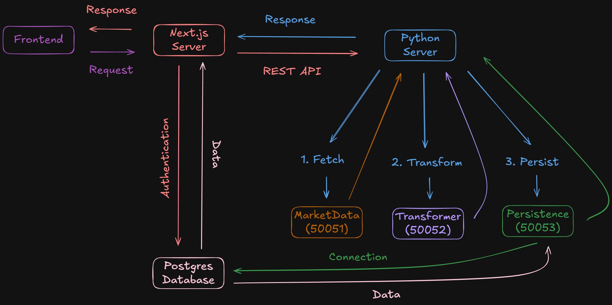

# R U Trading

Paper trading web application that simulates stock market trading using real-time data, allowing users to practice investing strategies without financial risk.

Senior project for Rowan University, advised by Professor McKee.

**Team:** Kyle Graham Matzen (Scrum/Lead), Nitin Sobti (Scrum/Lead), Josh Odom, Lucas Souder, Sean Twomey

## Overview

- Authentication with account registration and session management
- Single quote endpoint that fetches real-time market data through the gRPC pipeline

**Planned:**

- Virtual cash balance for simulated trading
- Dashboard for searching stocks, viewing live and historical price charts, and executing trades
- Portfolio tracking with holdings, average cost basis, unrealized gains/losses, and full transaction history
- Financial news integration from RSS/XML feeds displayed alongside stock data
- Watchlist for tracking saved stocks with current prices and daily changes
- Settings page for profile management and account actions

## Architecture



*Last updated: February 19, 2026*

The Next.js frontend communicates with a FastAPI gateway over REST, which orchestrates a sequence of [unary RPCs](https://grpc.io/docs/what-is-grpc/core-concepts/#unary-rpc) across gRPC microservices where each service processes the data before the result returns in one round trip. Authentication is handled by [Better Auth](https://www.better-auth.com/) on the Next.js server, and all services share a single Postgres database.

### Services

| Service | Port | Description |
|---|---|---|
| [Market Data](backend/services/market_data) | 50051 | Fetches live quotes from [TwelveData](https://twelvedata.com/) |
| [Transformer](backend/services/transformer) | 50052 | Computes derived values and normalizes raw market data |
| [Persistence](backend/services/persistence) | 50053 | Persists processed data to Postgres |
| [Scheduler](backend/services/scheduler) | — | Polls the pipeline on an interval, adjusts by market hours |

The gRPC architecture is designed to be extensible, allowing new services to be added to the pipeline by defining a .proto file and wiring it in. Proto definitions live in [`backend/lib/proto/`](backend/lib/proto/) and shared Python library code lives in [`backend/lib/trading_lib/`](backend/lib/trading_lib/).

### Database

Schema is defined in `web/src/db/schema.ts` using [Drizzle ORM](https://orm.drizzle.team/) (single source of truth). Python services use SQLAlchemy models as read/write mappings against the same tables. Migrations are handled exclusively by Drizzle (`bun migrate` runs `drizzle-kit push`).

## Getting Started

**Prerequisites:** [Docker Desktop](https://www.docker.com/products/docker-desktop/), [Bun](https://bun.sh), [uv](https://docs.astral.sh/uv/getting-started/installation/)

```bash
bun install
bun setup
```

The setup script will start Postgres via Docker Compose, copy `.env.example` files, generate a `BETTER_AUTH_SECRET`, install all dependencies, and generate gRPC proto code.

Then run the database migration and start:

```bash
bun migrate
bun dev
```

Open http://localhost:3000/login, create an account, and you'll see the dashboard.

If you edit `.proto` files, regenerate code with `bun dev:gen`.

## Testing

```bash
# Service tests (example: transformer)
cd backend/services/transformer
uv run pytest

# Integration tests
cd backend
uv run pytest tests/

# Web tests
cd web
bun test
```

## Docker

To run gRPC services via Docker instead of locally:

```bash
docker compose up -d market-data transformer persistence scheduler
```

## Contributing

See [CONTRIBUTING.md](.github/CONTRIBUTING.md) for development setup and guidelines.

## License

MIT License. See [LICENSE](LICENSE) for details.

## AI Use Statement

The following contributions were made to this README by Opus 4.6 Extended (Anthropic), solely for the README and organization of separating the project into its current folder structure:

- Grammar and Spelling Check
- Minor Wording and Clarity Improvements
- Final Proofreading of the Product Description
- Feedback on Organization and Structure
