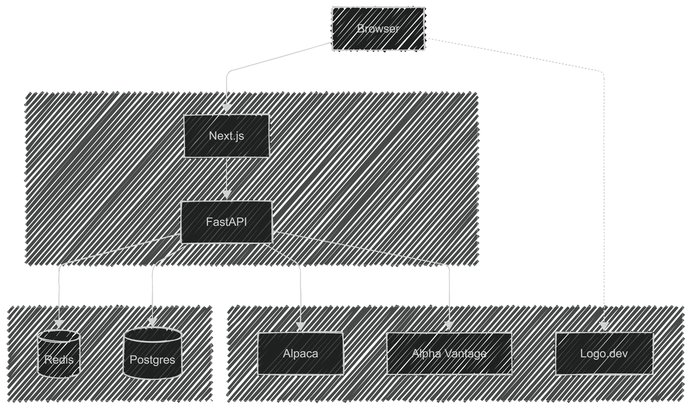

# R U Trading

<p align="center"><a href="https://nextjs.org/"></a><a href="https://www.typescriptlang.org/"></a><a href="https://fastapi.tiangolo.com/"></a><a href="https://www.python.org/"></a><a href="https://www.postgresql.org/"></a><a href="https://redis.io/"></a><a href="https://bun.sh/"></a></p>

Paper trading web application that simulates stock market trading using real-time data, allowing users to practice investing strategies without financial risk.

Senior project for Rowan University, advised by Professor McKee.

**Team:** Kyle Graham Matzen (Scrum/Lead), Nitin Sobti (Scrum/Lead), Josh Odom, Lucas Souder, Sean Twomey

## Architecture



A Next.js frontend talks to a FastAPI backend over REST, with a WebSocket channel for live quotes. Market data comes from [Alpaca](https://alpaca.markets/) and is cached in Redis (hot) and Postgres (warm) before falling back to Alpaca REST. All outbound Alpaca calls go through a shared sliding-window rate limiter.

The schema lives in `web/src/db/schema.ts` as the single source of truth via [Drizzle ORM](https://orm.drizzle.team/), with the Python backend reading and writing through SQLAlchemy models against the same tables. Migrations are handled exclusively by Drizzle (`bun db:push`).

## Overview

- Account registration and sessions powered by [Better Auth](https://www.better-auth.com/)
- Portfolio dashboard with positions, holdings, orders, and activity history
- Stock detail pages with live price, candlestick charts, and trade execution
- Order placement with buying-power reservations and a full transaction ledger
- Watchlists, symbol search with trending tickers, and per-symbol financial news
- Quotes from [Alpaca](https://alpaca.markets/) backed by three-tier caching across Redis, Postgres, and REST, plus a live WebSocket stream with per-user subscriptions
- Company profiles from Alpha Vantage with logos from [Logo.dev](https://logo.dev), themed to the user's preference

## Getting Started

**Prerequisites:** [Docker Desktop](https://www.docker.com/products/docker-desktop/), [Bun](https://bun.sh), [uv](https://docs.astral.sh/uv/getting-started/installation/)

```bash
bun install
bun setup
```

The setup script will start Postgres and Redis via Docker Compose, copy `.env.example` files, generate a `BETTER_AUTH_SECRET`, and install dependencies.

Then push the database schema and start:

```bash
bun db:push
bun dev
```

Open http://localhost:3000/login, create an account, and you'll see the dashboard.

## Scripts

```bash
bun setup        # first-time project setup (Docker, env files, deps)
bun dev          # start web + api concurrently
bun db:push      # push Drizzle schema to Postgres (no migration files)
bun db:generate  # generate a migration SQL file from schema diff
bun db:migrate   # run pending migration files
bun db:studio    # open Drizzle Studio GUI
```

## Testing

```bash
# API tests
cd backend
uv run pytest tests/

# Web tests
cd web
bun test
```

## Docker

For local services only:

```bash
docker compose up -d
```

## AI Use Statement

The following contributions were made to this README by Opus 4.6 Extended (Anthropic), solely for the README and organization of separating the project into its current folder structure:

- Grammar and Spelling Check
- Minor Wording and Clarity Improvements
- Final Proofreading of the Product Description
- Feedback on Organization and Structure
