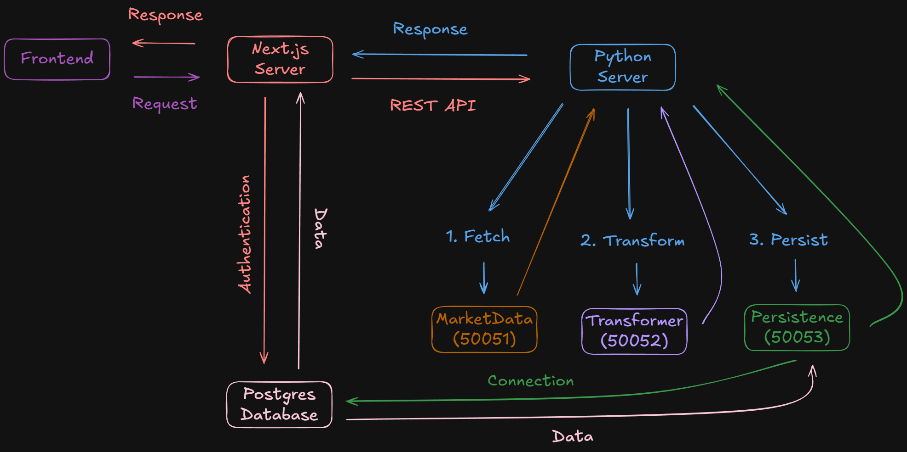

# R U Trading

Paper trading web application that simulates stock market trading using real-time data, allowing users to practice investing strategies without financial risk.

Senior project for Rowan University, advised by Professor McKee.

**Team:** Kyle Graham Matzen (Scrum/Lead), Nitin Sobti (Scrum/Lead), Josh Odom, Lucas Souder, Sean Twomey

## Overview

- Authentication with account registration and session management
- Real-time quotes from Alpaca with three-tier caching (Redis, Postgres, REST fallback)
- Historical candlestick charts with intraday, daily, and aggregated timeframes
- Symbol search backed by Alpaca asset data synced to Postgres
- Order placement and portfolio management with holdings and transaction history
- Shared sliding-window rate limiter across all Alpaca API calls
- WebSocket-based live quote streaming with per-user tracking and reconnection grace period (mock data, Alpaca feed pending)
- Watchlist for tracking saved stocks with current prices and daily changes
- Settings page for profile management and account actions

**Planned:**

- Dashboard with portfolio value, holdings breakdown, and daily movers
- Financial news integration filtered by symbol
- Stock detail page with live price, charts, and trade execution
- Real-time Alpaca feed to replace mock WebSocket price data

## Architecture



*Last updated: March 11, 2026*

The Next.js frontend communicates with a FastAPI backend over REST. The backend fetches market data from [Alpaca](https://alpaca.markets/), caches quotes in Redis (hot) and Postgres (warm), and falls back to Alpaca REST on cache miss. Authentication is handled by [Better Auth](https://www.better-auth.com/) on the Next.js server.

### Quote Flow

1. API receives `/api/quote?ticker=...`
2. Checks Redis hash (`quote:<ticker>`) for a fresh cached quote
3. Falls back to Postgres `quote` table if Redis misses
4. Fetches from Alpaca snapshot endpoint on full cache miss
5. Writes back to Redis and upserts into Postgres

### Historical Bars Flow

1. API receives `/api/historical-bars?ticker=...&timeframe=...&start=...`
2. Intraday timeframes (1Min through 1Hour) fetch directly from Alpaca REST, never stored
3. Daily bars read from the `daily_bar` table, backfilling gaps from Alpaca on demand
4. Aggregated timeframes (1Week through 1Year) use SQL aggregation over daily bars

### Database

Schema is defined in `web/src/db/schema.ts` using [Drizzle ORM](https://orm.drizzle.team/) (single source of truth). Python backend uses SQLAlchemy models as read/write mappings against the same tables. Migrations are handled exclusively by Drizzle (`bun db:push`).

## Getting Started

**Prerequisites:** [Docker Desktop](https://www.docker.com/products/docker-desktop/), [Bun](https://bun.sh), [uv](https://docs.astral.sh/uv/getting-started/installation/)

```bash
bun install
bun setup
```

The setup script will start Postgres and Redis via Docker Compose, copy `.env.example` files, generate a `BETTER_AUTH_SECRET`, and install dependencies.

Then push the database schema and start:

```bash
bun db:push
bun dev
```

Open http://localhost:3000/login, create an account, and you'll see the dashboard.

## Scripts

```bash
bun setup        # first-time project setup (Docker, env files, deps)
bun dev          # start web + api concurrently
bun db:push      # push Drizzle schema to Postgres (no migration files)
bun db:generate  # generate a migration SQL file from schema diff
bun db:migrate   # run pending migration files
bun db:studio    # open Drizzle Studio GUI
```

## Testing

```bash
# API tests
cd backend
uv run --package trading-api pytest api/tests/

# Web tests
cd web
bun test
```

## Docker

For local services only:

```bash
docker compose up -d
```

## Contributing

See [CONTRIBUTING.md](.github/CONTRIBUTING.md) for development setup and guidelines.

## License

MIT License. See [LICENSE](LICENSE) for details.

## AI Use Statement

The following contributions were made to this README by Opus 4.6 Extended (Anthropic), solely for the README and organization of separating the project into its current folder structure:

- Grammar and Spelling Check
- Minor Wording and Clarity Improvements
- Final Proofreading of the Product Description
- Feedback on Organization and Structure
